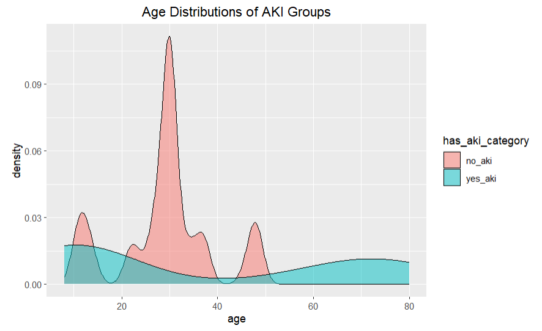
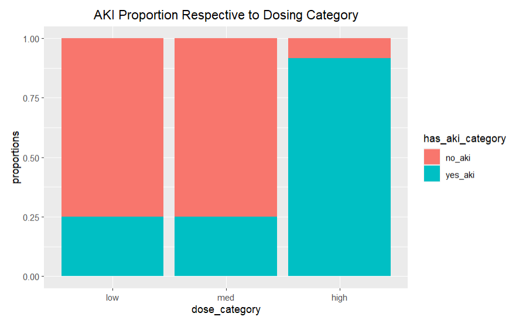
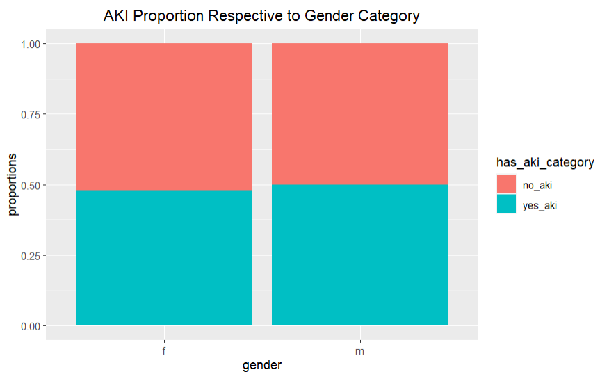
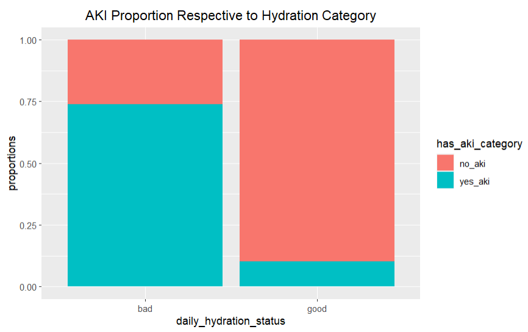
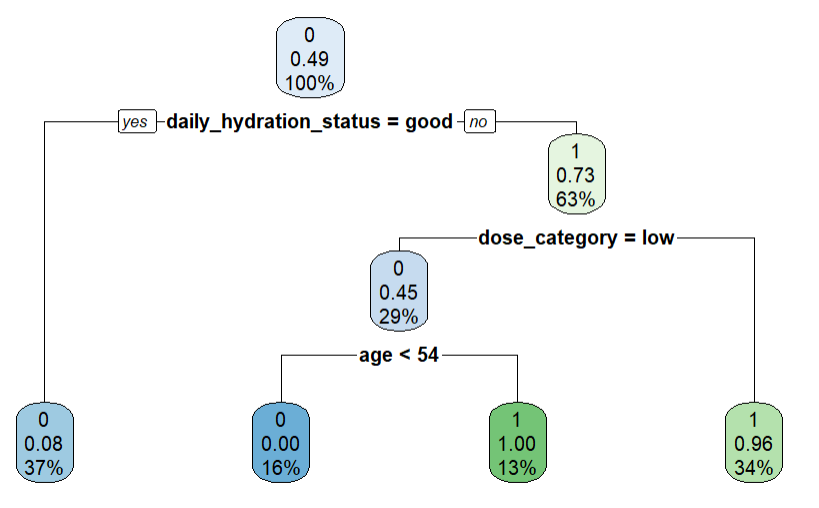

# drug-side-effect-prediction

## About Acute Kidney Injury

Acute Kidney Injury(AKI) is when your kidney function decreases suddenly relative to its normal function. It can range from partial function reduction to complete shutoff. Prolong AKI can lead to kidney failure. AKI also complicates treatment process because lots of drugs  rely on the kidney for removal.
Research has shown that patients with AKI tend to stay in the hospital longer 
[(source)](https://link.springer.com/article/10.1007/s00467-019-04431-3).

One common cause of AKI is the medication class named  Non-Steroidal Anti-inflammatory Drugs(NSAID). A common NSAID is Ibuprofen which is a popular over the counter pain killer. From this dataset, we will try to predict which patients on Ibuprofen will likely experience an AKI. This can be helpful information to save healthcare cost by promoting early interventions on those likely to get AKI.

## About the Data set

This  synthetic dataset gives information related to patients with or without AKI that showed up to a hospital. Dataset has 7 columns. Here the goal is to predict if the patient has AKI or not using a decision tree algorithm.

* Attribute Information
  +	patient_id 
      +	__Meaning__: The unique ID for a patient
      +	__Variable Type__: string
      +	__Possible values__:  any numbers from 1 to infinity
  +	gender 
      +	__Meaning__: the biological sex of the patient(male or female). 
      +	__Variable Type__: string
      +	__Possible values__:  ‘m’ or ‘f’
  +	age 
      +	__Meaning__: time since birth(years)
      +	__Variable Type__: double
      +	__Possible values__:  25 , 45, etc
  +	drug_name 
      +	__Meaning__: name of the drug
      +	__Variable Type__: string
      +	__Possible values__: ‘ibuprofen’
  +	dose_category
      +	__Meaning__: dose  strength category of the drug
      +	__Variable Type__: string
      +	__Possible values__:  ‘low’ means low dose; ‘med’ means average dose; ‘high’ means overdose
  +	daily_hydration_status
      +	__Meaning__:  How much water the person drinks daily
      +	__Variable Type__: string
      +	__Possible values__:   ‘bad’ means the person doesn’t really meet daily hydration requirements; ‘good’ means the person meets the daily hydration requirements.
  +	has_aki 
      +	__Meaning__: This is the target we are interested in predicting. 1 means the patient has Acute kidney injury (AKI). 0 means the person doesn’t have AKI
      +	__Variable Type__: integer
      +	__Possible values__:   1 or 0

## Group Comparison graph 1

- insight: Not normally distributed. Seems like the seniors and children/young adults are more likely to suffer AKI from Ibuprofen

## Group Comparison graph 2

- insight: Looks like high dose category has much higher proportion of AKI compared to low and med doses.

## Group Comparison graph 3

- insight: Gender seems to have no impact on whether a patient acquires AKI

## Group Comparison graph 4

- insight: Patients in the bad hydration status group has much higher proportion of AKI

## Decision Tree Model

* insights:
  + We know that  old age is a risk factor [https://www.nhs.uk/conditions/acute-kidney-injury/] .
  + Good hydration status is important to maintain fluid flow to the kidneys so that AKI doesn't happen.
  + Makes sense that low dose is least likely going to lead to AKI.
  + As predicted from visualizing the gender proportion graph, gender feature doesn't really help us predict if someone has AKI. That is probably why gender feature wasn't included in the tree.

## Conclusion
- Exploratory data analysis showed that patients that experienced AKI are usually involved with factors like high dose Ibuprofen, old age and/or  bad daily hydration status. Gender wasn't an important factor as we seen in the graph and the exclusion of the feature in the decision tree. Overall, the accuracy of the model was 93%. Decision trees tend to over fit so we could improve the accuracy validity by tuning the parameters like the depth of the tree, minimum samples in leaf nodes , etc.